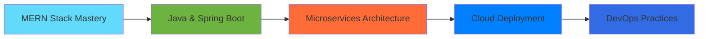

<div align="center">

# 👋 Hi, I'm Vaibhav Jadhav


### 💻 Crafting Digital Experiences | 🚀 Turning Ideas Into Reality

[](https://www.linkedin.com/in/contact-vaibhav-jadhav/)
[](your-portfolio-url)
[](mailto:jadhavvaibhav20997@gmail.com)
[](https://github.com/YOUR_USERNAME)

</div>

---

---

## 💫 About Me

```javascript
const vaibhav = {
    name: "Vaibhav Jadhav",
    title: "Full Stack Developer",
    location: "India 🇮🇳",
    expertise: ["MERN Stack", "RESTful APIs", "Real-time Apps"],
    currentlyLearning: ["Java Spring Boot", "Microservices", "System Design"],
    techPhilosophy: "Write code that speaks for itself",
    lifeMotto: "Build, Break, Learn, Repeat 🔄"
};

console.log(`${vaibhav.name} is ready to collaborate! 🚀`);
```

🎯 **Current Focus:** Mastering full-stack development while diving deep into enterprise Java frameworks

💡 **What Drives Me:** Building applications that solve real-world problems with clean, maintainable code

🌱 **Learning Journey:** Transitioning from MERN stack expertise to exploring the robust world of Spring Boot

⚡ **Fun Fact:** I believe the best code is the code you don't have to write!

<details>
<summary>📚 More About My Journey</summary>
<br>

- 🏗️ Building production-ready applications with modern tech stacks
- 🎨 Passionate about creating intuitive user interfaces and seamless experiences
- 🔐 Strong focus on authentication, security, and data integrity
- 🚀 Constantly exploring new technologies and best practices
- 🤝 Open to collaborating on innovative projects and open-source contributions

</details>

---

## 🛠️ Tech Arsenal

<table align="center">
<tr>
<td align="center" width="50%">

### 🎨 Frontend Magic


</td>
<td align="center" width="50%">

### ⚙️ Backend Power


</td>
</tr>
<tr>
<td colspan="2" align="center">

### 🔧 Tools & Workflow


</td>
</tr>
</table>

---

## 📊 GitHub Stats

<div align="center">
  


</div>

---

## 🏆 Featured Projects

### 🌟 [Online Code Editor](project-link)
**Tech:** React • Node.js • Express • MongoDB • JWT

A full-stack MERN application featuring user authentication, real-time updates, and responsive design. Implemented RESTful APIs and state management with Redux.

### 🌟 [Food Plaza](project-link)
**Tech:** React • Spring Boot • MySQL • REST API

Building a modern application exploring Spring Boot backend with React frontend, focusing on microservices architecture and clean code principles.

### 🌟 [I Chat ](project-link)
**Tech:** MERN Stack • Socket.io • Cloud Deployment

Real-time application with WebSocket communication, featuring advanced state management and optimized performance.

---

## 📈 Contribution Graph

[](https://github.com/YOUR_USERNAME)

---

## 🎯 Current Learning Journey



---

## 💼 What I'm Looking For

- 🤝 Collaborating on **open-source projects**
- 🌐 Contributing to **MERN stack applications**
- 📚 Learning opportunities in **enterprise Java development**
- 💡 Innovative projects that solve **real-world problems**

---

## 📫 Let's Connect!

<div align="center">

**I'm always open to interesting conversations and collaboration opportunities!**

[](your-linkedin-url)
[](your-twitter-url)
[](your-portfolio-url)

---

### ⭐ *"Code is like humor. When you have to explain it, it's bad."* – Cory House


</div>

---

<div align="center">
  
</div>
